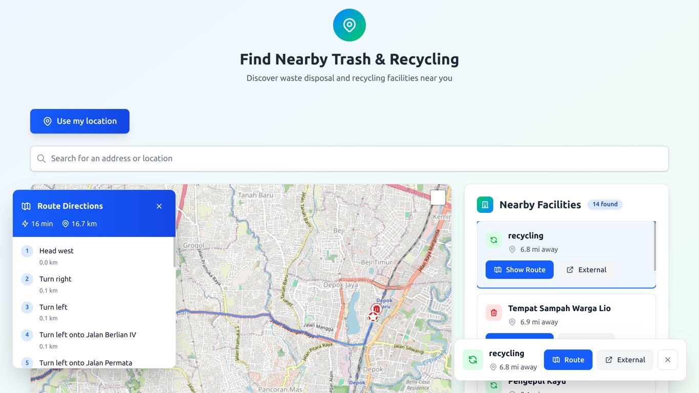

# Trash Dump Map

A mobile-first SvelteKit application that helps users quickly find nearby trash and recycling facilities. The app runs entirely in the browser using public map and geocoding services, providing directions to waste disposal facilities without requiring any backend infrastructure.



## Features

- **Location-based search**: Find facilities using your current location or by searching for an address
- **Interactive map**: View facilities on an interactive map with markers for different facility types
- **Facility details**: See facility information including name, type, distance, and address
- **External directions**: One-tap access to open directions in your default maps app
- **Mobile-first design**: Optimized for mobile devices with responsive layout
- **Client-only**: No backend required - everything runs in the browser

## Problem & Solution

**Problem**: People struggle to quickly find nearby, valid trash/recycling facilities.

**Solution**: A client-only web application that uses public map services to show nearby facilities and provides one-tap access to external directions. The goal is to get users from landing to their first nearby result in under 30 seconds.

## Getting Started

### Prerequisites

- Node.js (version 18 or higher)
- pnpm (recommended) or npm

### Installation

1. Clone the repository:
```sh
git clone <repository-url>
cd trash-dump-map
```

2. Install dependencies:
```sh
pnpm install
```

3. Start the development server:
```sh
pnpm dev

# or start the server and open the app in a new browser tab
pnpm dev -- --open
```

## Building for Production

To create a production version of your app:

```sh
pnpm build
```

You can preview the production build with:
```sh
pnpm preview
```

## Technology Stack

- **Framework**: SvelteKit with TypeScript
- **Styling**: TailwindCSS
- **Maps**: Leaflet with OpenStreetMap tiles
- **Geocoding**: Nominatim API
- **Package Manager**: pnpm

## Data Sources

The application uses:
- **OpenStreetMap data** via Overpass API for facility discovery
- **Nominatim** for geocoding and address search
- **External map services** (Google Maps, Apple Maps, OSM) for directions

## User Stories

- **US1**: Use my current location to find the nearest dump
- **US2**: Search by address/place to find facilities
- **US3**: View facility details including name, type, distance, and address
- **US4**: Get directions via external maps app
- **US5**: Mobile-first experience with fast loading and accessibility

## Performance Targets

- First interactive under 3 seconds on 4G
- Time-to-first-result under 10 seconds
- Directions click-through rate > 40%

## Privacy & Compliance

- Location data is only requested when needed and never stored
- Respects OpenStreetMap and Nominatim usage policies
- Proper attribution displayed for all data sources
- No backend means no server-side data collection

## Contributing

This is a client-only MVP focused on simplicity and performance. Future enhancements may include:
- Crowdsourced facility submissions
- In-app routing
- Offline caching
- Internationalization

## Acknowledgments

- OpenStreetMap contributors for facility data
- Nominatim for geocoding services
- Leaflet for mapping functionality
